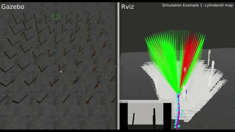

# Tentabot-DRL: Robot Navigation in Dynamic Environments using Deep Reinforcement Learning with Pre-sampled Trajectory Value Observations
   

# Tentabot-Heuristic: Reactive Navigation Framework for Mobile Robots by Heuristically Evaluated Pre-sampled Trajectories (Tentacles)
[](https://youtu.be/5vZSEuWUXe4) [](https://youtu.be/5vZSEuWUXe4)

### 1. Citation
```
@article{akmandor2021reactive,
  title={Reactive navigation framework for mobile robots by heuristically evaluated pre-sampled trajectories},
  author={Akmandor, Ne{\c{s}}et {\"U}nver and Padir, Ta{\c{s}}kin},
  journal={International Journal of Robotic Computing},
  volume={3},
  number={1},
  pages={47--68},
  year={2021}
}
```
```
@inproceedings{akmandor20203d,
  title={A 3d reactive navigation algorithm for mobile robots by using tentacle-based sampling},
  author={Akmandor, Ne{\c{s}}et {\"U}nver and Padir, Ta{\c{s}}kin},
  booktitle={2020 Fourth IEEE International Conference on Robotic Computing (IRC)},
  pages={9--16},
  year={2020},
  organization={IEEE}
}
```

### 2. Related Papers
* Akmandor, N. Ü. and Padır, T., "**Reactive navigation framework for mobile robots by heuristically evaluated pre-sampled trajectories**", International Journal of Robotic Computing 3.1 (2021): 47-68, [[DOI:10.35708/RC1870-126265]](https://b5589c9e-f1e3-4455-9929-0d78781398a4.filesusr.com/ugd/e49175_ccc84165293e42f79a1d4ad98260e8b9.pdf). [[arXiv:10.35708/RC1870-126265]](https://arxiv.org/abs/2105.08145)
* Akmandor, N. Ü. and Padır, T., "**A 3D Reactive Navigation Algorithm for Mobile Robots by Using Tentacle-Based Sampling**", 2020 Fourth IEEE International Conference on Robotic Computing (IRC), Taichung, Taiwan, 2020, pp. 9-16, [[DOI:10.1109/IRC.2020.00009]](https://doi.org/10.1109/IRC.2020.00009). [[arXiv:2001.09199]](https://arxiv.org/abs/2001.09199).
* Von Hundelshausen, Felix, et al. "**Driving with tentacles: Integral structures for sensing and motion**." Journal of Field Robotics 25.9 (2008): 640-673, [[DOI:10.1002/rob.20256]](https://doi.org/10.1002/rob.20256).

### 2. Videos

* [[IRC 2020 - supplementary video]](https://www.youtube.com/watch?v=5vZSEuWUXe4&t)
* [[IRC 2020 - presentation]](https://youtu.be/Y5FCiJPXmlo)

### 3 Installation

The system has been tested with 20.04 (ROS Noetic).

Follow the tutorials to
- [install ROS](http://wiki.ros.org/ROS/Installation) based on the Ubuntu version.
- [set up catkin workspace](http://wiki.ros.org/ROS/Tutorials/InstallingandConfiguringROSEnvironment).

#### 3.1 Install [flexible-collision-library/fcl](https://github.com/flexible-collision-library/fcl) following their instructions using CMake.

#### 3.2 Install [libccd](https://github.com/danfis/libccd) following their instructions using CMake.

#### 3.3 Install [rotors_simulator](https://github.com/ethz-asl/rotors_simulator.git) package into the src folder.
#### 3.4 Install 'noetic-akmandor' branch of [turtlebot3](https://github.com/RIVeR-Lab/turtlebot3/tree/noetic-akmandor) package into the src folder.
#### 3.5 Install 'noetic-akmandor' branch of [LMS1xx](https://github.com/RIVeR-Lab/LMS1xx/tree/noetic-akmandor) package into the src folder.
#### 3.6 Install 'noetic-akmandor' branch of [geometry2](https://github.com/RIVeR-Lab/geometry2/tree/noetic-akmandor) package into the src folder.
#### 3.7 Install [catkin-simple](https://github.com/catkin/catkin_simple) package into the src folder.
#### 3.8 Install [forest_gen](https://github.com/ethz-asl/forest_gen) package into the src folder.
#### 3.9 Install [mav_comm](https://github.com/ethz-asl/mav_comm) package into the src folder.
#### 3.10 Install [octomap_rviz_plugins](https://github.com/OctoMap/octomap_rviz_plugins) package into the src folder.
#### 3.11 Install [pedsim_ros](https://github.com/srl-freiburg/pedsim_ros.git) package into the src folder.
#### 3.12 Install [openai-ros](https://github.com/RIVeR-Lab/openai_ros) package into the src folder.
#### 3.13 Install [tentabot](https://github.com/RIVeR-Lab/tentabot) package into the src folder.

```
cd ~/catkin_ws/src
git clone https://github.com/ethz-asl/rotors_simulator.git
git clone https://github.com/RIVeR-Lab/turtlebot3.git #'noetic-akmandor' branch*
git clone https://github.com/RIVeR-Lab/LMS1xx.git #'noetic-akmandor' branch*
git clone https://github.com/RIVeR-Lab/geometry2.git #'noetic-akmandor' branch*
git clone https://github.com/catkin/catkin_simple.git
git clone https://github.com/ethz-asl/forest_gen.git
git clone https://github.com/ethz-asl/mav_comm.git
git clone https://github.com/OctoMap/octomap_rviz_plugins.git
git clone https://github.com/srl-freiburg/pedsim_ros.git
git clone https://github.com/RIVeR-Lab/openai_ros.git
git clone https://github.com/RIVeR-Lab/tentabot.git
```
##### *Switch to 'noetic-akmandor' branch in the package (turtlebot3,LMS1xx,geometry2):
```
git checkout noetic-akmandor
```
#### 3.14 (Required for Tentabot-DRL) Install [stable-baselines3](https://stable-baselines3.readthedocs.io/en/master/guide/install.html#stable-release) Python package following their instructions.

#### 3.15 Install ROS dependencies
```
sudo apt-get install libsuitesparse-dev
sudo apt-get install libnlopt-dev
```

#### 3.16 Install other ROS dependencies using rosdep tool:

Follow the instructions under 'Prerequisites' and install rosdep tool based on the ROS version: [Noetic rosdep](http://wiki.ros.org/noetic/Installation/Source).

ROS Noetic example of installing dependencies using rosdep tools:
```
cd ~/catkin_ws
rosdep install --from-paths src --ignore-src -r -y
```

#### 3.17 Install Python dependencies
```
pip install GitPython
pip install squaternion
```

#### 3.18 Build the catkin workspace:
```
cd ~/catkin_ws
catkin build
```

#### 3.19 Source the workspace, after successfully built:
```
source devel/setup.bash
```

### 4. Simulation examples

#### 4.1 Tentabot-DRL:

In separate terminal windows:

##### 4.1.1 Start Gazebo simulation:
```
roslaunch tentabot tentabot_mobile_garden.launch
```

##### 4.1.2 Start Rviz for visualization:
```
roslaunch tentabot tentabot_drl_rviz.launch
```

##### 4.1.3 Start map utility:
```
roslaunch tentabot map_utility_server_turtlebot3.launch
```

##### 4.1.4 Start Tentabot-DRL service:
```
roslaunch tentabot tentabot_drl_service.launch
```

##### 4.1.5 Start training:
```
roslaunch tentabot tentabot_drl_training.launch
```
OR

##### 4.1.5 Start testing:
```
roslaunch tentabot tentabot_drl_testing.launch
```

#### 4.2 Tentabot-Heuristic:

##### Example 1:
```
roslaunch tentabot tentabot_heuristic_firefly_cylinders.launch
```

##### Example 2:
```
roslaunch tentabot tentabot_heuristic_firefly_forest.launch
```

##### Example 3:
```
roslaunch tentabot tentabot_heuristic_turtlebot3.launch
```

### 6. Credentials
Tentabot was developed at the [RIVeR Lab, Northeastern University](http://robot.neu.edu/).
